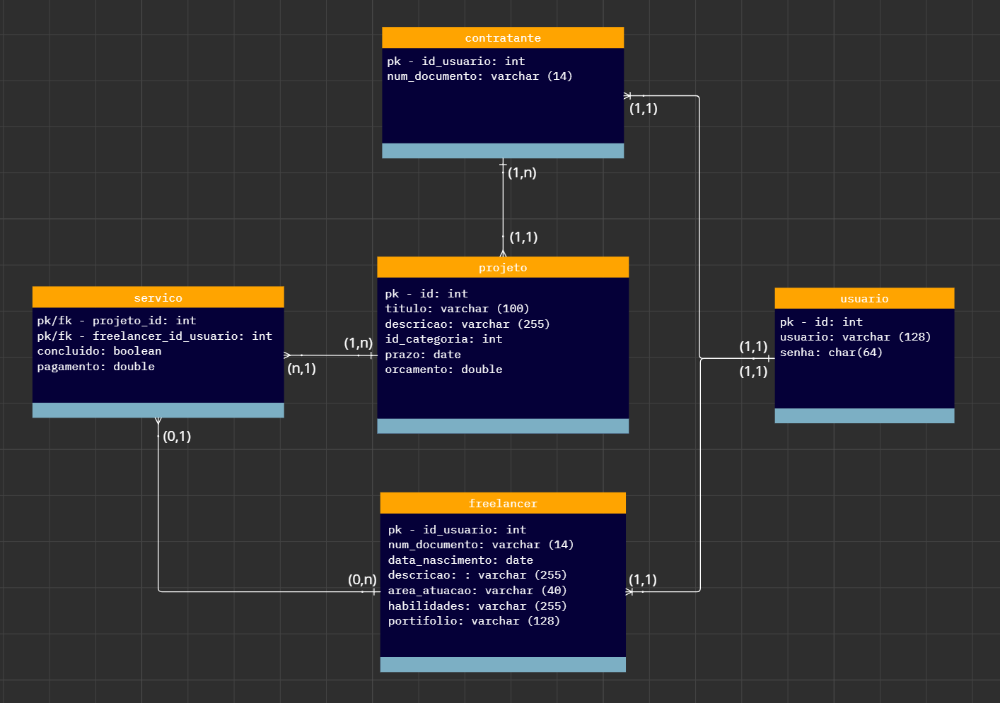

## 4. Projeto da solução

### 4.1. Modelo de dados

---

### 4.2. Tecnologias

| **Dimensão**   | **Tecnologia**  |
| ---            | ---             |
| SGBD           | Postgre         |
| Front end      | React           |
| Back end       | Java SpringBoot |
| Deploy         | Github Pages    |

